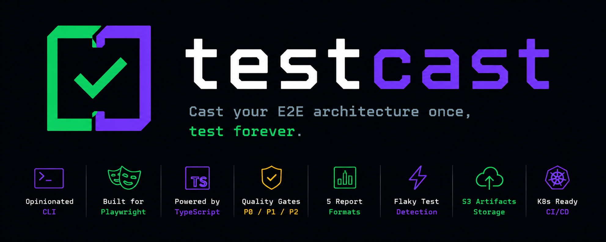

<p align="center">
  <a href="README.id.md">🇮🇩 Baca dalam Bahasa Indonesia</a>
</p>

<p align="center">
  
</p>

<p align="center">
  
</p>

# TestCast — E2E Test Boilerplate

Enterprise-grade E2E test boilerplate built with Playwright + TypeScript. TestCast provides a production-ready framework for automated testing, currently targeting [SauceDemo](https://www.saucedemo.com/) as the demo application.

---

## 🚀 Quick Start — Just 4 Commands

```bash
# 1. Clean previous reports & artifacts
make clean

# 2. Run all tests + generate all reports (HTML + Excel + Allure)
make test

# 3. Open ALL reports at once (Playwright HTML + Allure + Excel + CSV)
make show-all-report

# ─── That's it! ───────────────────────────────────────────────────

# Bonus: Wipe everything including flaky history
make clean-all
```

> **No config needed** — works out of the box. Tests hit the live SauceDemo site at `https://www.saucedemo.com/`.

---

## ✨ Genius Features

### 🎯 Quality Gates — P0/P1/P2 Test Prioritization

| Tag | Severity | Purpose | Gate |
|-----|----------|---------|------|
| `@p0` or `@critical` | CRITICAL | Must-pass for any release | **Release blocker** |
| `@p1` | NORMAL | Functional/PR gate | **PR required** |
| `@p2` | MINOR | Edge/boundary cases | Nightly only |

**Smart execution:**
```bash
pnpm test --grep "@p0"     # Only critical tests (fast gate)
pnpm test --grep "@p1"     # Standard functional tests
pnpm test --grep "@p0"     # Pipeline gate before merge
```

Tests are automatically tagged with Allure severity based on `@p0`/`@p1`/`@p2` tags in test titles.

---

### 📊 Multi-Reporter System

Simultaneously generates **5 report formats**:

| Reporter | Output | Purpose |
|---------|--------|---------|
| Playwright HTML | `reports/playwright-report/` | Local dev debugging |
| Allure | `reports/allure-results/` | CI trend analysis |
| Excel | `test-results/excel-report/enterprise-test-report.xlsx` | Executive summary |
| CSV | `test-results/excel-report/test-results.csv` | Data processing |
| JSON | `reports/test-results/playwright-json-results.json` | Integration pipelines |

**Enterprise Excel report with 5 sheets:**
1. **Executive Summary** — High-level metrics, pass/fail, flaky count, duration
2. **Test Results Detail** — Per-TC breakdown with errors, traces, retries
3. **Browser Matrix** — Cross-browser consistency check
4. **Flaky History** — 10-run trend per test, stability scoring
5. **Coverage Map** — Feature coverage overview with status

---

### 🔄 Flaky Test Intelligence

Tracks test reliability over **10 consecutive runs**:

- Flaky rate ≥30% → marked ⚠️ FLaky
- Flaky rate <30% → marked ✅ Stable
- History persisted in `.test-flaky-history.json`
- Automatic flaky detection in Excel report

```bash
# View flaky tests
make show-excel   # Flaky History sheet
```

---

### ☁️ S3 Artifact Management

Automatic upload of test artifacts to S3/MinIO:

- **Allure results** → `artifacts/{project}/{branch}/{buildId}/allure-results/`
- **Playwright report** → `artifacts/{project}/{branch}/{buildId}/playwright-report/`
- **Excel report** → `artifacts/{project}/{branch}/{buildId}/test-results/excel-report/`
- **JSON results** → `artifacts/{project}/{branch}/{buildId}/test-results/`

Global teardown ensures S3 cleanup after test run completion.

---

### 🗄️ Database Validation Fixture

Direct MySQL connection for backend verification:

```typescript
test('verify cart in database', async ({ dbConnection }) => {
  const [rows] = await dbConnection.query('SELECT * FROM carts WHERE user_id = ?', [userId]);
  expect(rows.length).toBeGreaterThan(0);
});
```

Supports custom DB credentials via `.env`:
```bash
DB_HOST=localhost
DB_PORT=3306
DB_USER=test_user
DB_PASSWORD=test_password
DB_NAME=test_db
```

---

### 📋 Data-Driven Testing

Load test data from Excel or CSV:

```typescript
test('verify pricing', async ({ testData }) => {
  const prices = await testData.loadFromExcel('./test-data/prices.xlsx', 'Sheet1');
  for (const item of prices) {
    // validate pricing
  }
});
```

---

### 🚩 Feature Flags with Override

Override feature flags in tests:

```typescript
test('new checkout flow', async ({ featureFlags }) => {
  await featureFlags.setFlagOverride('new_checkout', true);
  // Test new feature
  featureFlags.clearOverrides();
});
```

Environment variable pattern: `FLAG_{FLAGNAME}` = `true`/`false`

---

### 📸 Visual Regression Testing (VRT)

Screenshot comparison with Visual Regression Tracker integration:

```typescript
test('checkout UI', async ({ vrt, takeScreenshot }) => {
  const screenshot = await takeScreenshot('checkout-page', { fullPage: true });
  const result = await vrt.compareScreenshot('checkout-page', screenshot);
  expect(result.passed).toBe(true);
});
```

Supports baseline capture, pixel threshold, and ignore areas.

---

### 🧪 Traced Steps with Screenshots

Every test step automatically captures screenshots for failure analysis:

```typescript
import { test, expect } from '../../fixtures/traced-steps';

test('checkout flow @p0 @smoke', async ({ page }) => {
  await page.click('.checkout-button');  // screenshot captured
  await page.fill('#postal-code', '12345');  // screenshot captured
});
```

---

### 🔐 Authenticated Test Fixture

Pre-authenticated pages for faster test execution:

```typescript
test('inventory page', async ({ loggedInPage }) => {
  // Already logged in as standard_user
  await expect(loggedInPage.locator('.inventory_item')).toHaveCount(6);
});
```

---

### 🌐 Cross-Environment Support

Switch between DEV/STAGING/PROD seamlessly:

```bash
NODE_ENV=DEV    pnpm test    # Uses https://www.saucedemo.com
NODE_ENV=STAGING pnpm test   # Uses staging.saucedemo.com
NODE_ENV=PROD   pnpm test    # Uses production
```

---

### 🔧 Execution Modes

| Mode | Command | Use Case |
|------|---------|----------|
| **Full** | `make test` | Complete test suite + all reports |
| **Quick** | `make test-quick` | Fast run, no reports |
| **UI** | `make test-ui` | Headed mode with slow motion |
| **Headed** | `make test-headed` | Visible browser |
| **Single browser** | `make test-chromium` | Chromium only |
| **Retry** | `CI=true pnpm test` | 2 retries on failure |

---

### 🏗️ CI/CD Ready

Pre-built pipelines for GitLab CI and GitHub Actions:

| Command | Pipeline | Browsers |
|---------|---------|----------|
| `make ci-mr` | MR sanity check | Chromium only |
| `make ci-full` | Full matrix | Chromium + Firefox + WebKit |
| `make ci-nightly` | Nightly run | Full + JUnit output |

---

### 🪝 Git Hooks (Husky + lint-staged)

Automatic code quality checks before commit:
- Biome linter + formatter
- TypeScript type checking
- Prevents bad code from entering codebase

```bash
pnpm prepare   # Install git hooks
```

---

### 📈 Performance Monitoring

Built-in performance tests measuring:
- Login response time
- Page load times
- Cart operations latency
- Checkout flow duration

---

### 🔍 6 User Types Covered

All SauceDemo user personas with distinct behaviors:

| User | What it tests |
|------|---------------|
| `standard_user` | Happy path, all features work |
| `locked_out_user` | Auth error handling |
| `problem_user` | Checkout subtotal bug (known bug) |
| `error_user` | Product render error handling |
| `visual_user` | Price display bug (known bug) |
| `performance_glitch_user` | Login performance timing |

---

### 🐛 Known Bug Verification

Intentional bug coverage for regression testing:
1. `problem_user` — Subtotal doubled on checkout
2. `visual_user` — Wrong inventory prices
3. `error_user` — Product description render failure
4. `performance_glitch_user` — 2000ms login delay

---

### 🎬 Trace, Screenshot & Video on Failure

Automatic capture when tests fail:
- **Trace** — Full execution trace (replayable in Playwright)
- **Screenshot** — Page state at failure
- **Video** — Recording of test run

Configure via environment:
```bash
PW_TRACE=retain-on-failure   # Trace on failure
PW_SCREENSHOT=on              # Always screenshots
PW_VIDEO=retain-on-failure   # Video on failure
```

---

## 📋 Step-by-Step Setup

### Prerequisites
- **Node.js 18+**
- **pnpm** (`npm install -g pnpm`)
- **macOS/Linux** (CI also supports Windows via WSL)

### Step 1 — Install Dependencies

```bash
pnpm install
```

### Step 2 — Install Playwright Browsers

```bash
pnpm exec playwright install
```

### Step 3 — (Optional) Install Git Hooks

```bash
pnpm prepare
```

### Step 4 — Run Tests

```bash
make test
```

This will:
- Run all 282+ tests against https://www.saucedemo.com/
- Generate Playwright HTML report
- Generate Excel enterprise report
- Generate Allure report results
- Log output to `logs/`

### Step 5 — View Reports

```bash
make show-all-report
```

Opens everything at once:
- **Playwright HTML** → `http://localhost:9323`
- **Allure Report** → `http://localhost:9324`
- **Excel Report** → `test-results/excel-report/enterprise-test-report.xlsx`
- **CSV Report** → `test-results/excel-report/test-results.csv`

---

## 🎯 Common Use Cases

### Run Only P0 Tests (Critical Path)
```bash
pnpm test --grep "@p0"
```

### Run Only P1 Tests
```bash
pnpm test --grep "@p1"
```

### Run Specific Test Suite
```bash
pnpm test tests/login/
pnpm test tests/checkout/
pnpm test tests/integration/
```

### Run in UI Mode (headed, slow motion)
```bash
make test-ui
```

### Run Quickly Without Reports
```bash
make test-quick
```

### Check Code Quality
```bash
make lint        # Run linter
make lint-fix    # Auto-fix issues
make format      # Format code
make type-check  # TypeScript check
```

---

## 🧹 Clean Commands

| Command | What it does |
|---------|-------------|
| `make clean` | Removes all test reports and artifacts (allure-results, playwright-report, test-results, trace, logs) |
| `make clean-all` | Wipes everything above + flaky/test history files |
| `make killport` | Kills any servers running on ports 9090, 9323, 9324 |

---

## 📊 Report Locations

| Report | Path | Command |
|--------|------|---------|
| Playwright HTML | `reports/playwright-report/index.html` | `make show-report` |
| Excel | `test-results/excel-report/enterprise-test-report.xlsx` | `make show-excel` |
| Allure | `reports/allure-results/` | `make show-allure` |
| CSV | `test-results/excel-report/test-results.csv` | (auto-opened with `show-all-report`) |

---

## 📁 Project Structure

```
/
├── tests/                     # 282+ test specs
│   ├── smoke/                # P0 smoke tests
│   ├── login/                 # Login flows
│   ├── cart/                  # Cart operations
│   ├── checkout/              # Checkout flows
│   ├── inventory/             # Product listing
│   ├── product/               # Product detail
│   ├── pricing/               # Price accuracy
│   ├── security/              # Auth & session security
│   ├── performance/           # Load & response times
│   ├── exception/             # Error handling
│   ├── negative/              # Invalid input
│   ├── boundary/             # Edge values
│   ├── corner/               # Extreme combinations
│   ├── integration/           # Multi-page workflows
│   ├── user-journeys/        # Cross-user E2E journeys
│   ├── user-types/           # All 6 user variations
│   └── bug-verification/     # Known bug regression
│
├── pages/                     # Page Object Models
├── fixtures/                  # Playwright fixtures
├── test-data/                 # Test data & user types
├── reporters/                  # Excel reporter
├── scripts/                   # CI/CD scripts
├── infra/k8s/                # Kubernetes configs
├── reports/                   # Generated reports
├── Makefile                   # All commands
└── playwright.config.ts       # Test runner config
```

---

## 🧪 Test Suites

| Suite | Directory | Priority |
|-------|-----------|---------|
| Login | `tests/login/` | P1 |
| Cart Operations | `tests/cart/` | P1 |
| Checkout Flow | `tests/checkout/` | P1 |
| Inventory | `tests/inventory/` | P1 |
| Product Detail | `tests/product/` | P1 |
| Pricing | `tests/pricing/` | P1 |
| Security | `tests/security/` | P1 |
| Performance | `tests/performance/` | P1 |
| Exception Handling | `tests/exception/` | P1 |
| Negative Input | `tests/negative/` | P2 |
| Boundary Values | `tests/boundary/` | P2 |
| Corner Cases | `tests/corner/` | P2 |
| Full Lifecycle | `tests/integration/` | P0 |
| User Types | `tests/user-types/` | P0 |
| User Journeys | `tests/user-journeys/` | P0 |
| Bug Verification | `tests/bug-verification/` | P2 |

---

## 👤 User Types

| User | Credentials | Behavior |
|------|-------------|----------|
| `standard_user` | `standard_user` / `secret_sauce` | Happy path — all features work correctly |
| `locked_out_user` | `locked_out_user` / `secret_sauce` | Blocked from login |
| `problem_user` | `problem_user` / `secret_sauce` | Checkout subtotal is doubled (known bug) |
| `error_user` | `error_user` / `secret_sauce` | Product detail shows render error |
| `visual_user` | `visual_user` / `secret_sauce` | Wrong inventory prices, broken images |
| `performance_glitch_user` | `performance_glitch_user` / `secret_sauce` | Login takes 2000ms |

---

## ⚙️ Environment Configuration

```bash
# .env (copy from .env.example if available)
NODE_ENV=DEV
BASE_URL_DEV=https://www.saucedemo.com
BASE_URL_STAGING=https://staging.saucedemo.com
BASE_URL_PROD=https://www.saucedemo.com

# Optional — enable as needed
VRT_API_URL=
VRT_API_KEY=
LD_CLIENT_ID=
LD_CLIENT_SECRET=
DB_HOST=localhost
DB_PORT=3306
DB_USER=test_user
DB_PASSWORD=test_password
DB_NAME=test_db
AWS_REGION=us-east-1
AWS_ACCESS_KEY_ID=
AWS_SECRET_ACCESS_KEY=
S3_BUCKET=testcast-artifacts
```

---

## 🔧 Makefile All Commands

```bash
# Installation
make install          # Install Playwright browsers
make prepare          # Install Husky git hooks

# Testing
make test            # Run all tests + all reports
make test-quick      # Run tests only, no reports
make test-ui         # UI mode (headed, slow)
make test-headed     # Run in headed mode
make test-chromium   # Chromium only
make test-firefox    # Firefox only
make test-webkit     # WebKit only

# Code Quality
make lint            # Run Biome linter
make lint-fix        # Auto-fix lint issues
make format          # Format code with Biome
make format-check    # Check formatting
make type-check      # TypeScript check

# Reports
make show-report       # Open Playwright HTML report
make show-excel       # Open Excel report
make show-csv         # Open CSV report
make show-allure      # Open Allure report (serve mode)
make show-all-report   # Open ALL reports at once

# Utilities
make killport          # Kill processes on ports 9090, 9323, 9324

# Clean
make clean            # Clean test results and reports
make clean-all        # Clean everything including test history

# CI/CD
make ci-mr            # GitLab CI — MR sanity check (Chromium only)
make ci-full          # GitLab CI — Full matrix (all browsers)
make ci-nightly       # GitLab CI — Nightly (full + JUnit)

# Database
make db_test          # Test MySQL database connection
```

---

## 🐛 Known Bugs (Intentional Test Targets)

These are **known issues in SauceDemo** verified by bug-specific tests:

1. **`problem_user` checkout bug** — Subtotal doubled on checkout overview
2. **`visual_user` pricing bug** — Inventory shows wrong prices (cart correct)
3. **`error_user` render bug** — Product detail description fails to render
4. **`performance_glitch_user` slow login** — 2000ms login delay

---

## 🔌 Fixtures Reference

| Fixture | Purpose |
|---------|---------|
| `page` | Playwright page (from `@playwright/test`) |
| `loggedInPage` | Pre-authenticated page |
| `authState` | Auth info for debugging |
| `testData` | Excel/CSV data loading |
| `featureFlags` | Feature flag overrides |
| `dbConnection` | MySQL connection |
| `s3Operations` | S3 artifact upload/download |
| `takeScreenshot` | VRT screenshot capture |

### Usage

```typescript
// Import from fixtures — NOT from @playwright/test directly
import { test, expect } from '../../fixtures/traced-steps';
import { LoginPage } from '../../pages/LoginPage';
import { SAUCE_DEMO_USERS } from '../../test-data/supported-users';

// Auth fixture
test('should login', async ({ loggedInPage }) => {
  await expect(loggedInPage.locator('.app_logo')).toBeVisible();
});

// Excel data loading
test('should load test data', async ({ testData }) => {
  const users = await testData.loadFromExcel('./test-data/test-users.xlsx', 'Sheet1');
});
```

> **Important**: Tests in subdirectories (e.g., `tests/boundary/`) must use `../../fixtures/traced-steps` — not `../fixtures` or `fixtures/traced-steps`.

---

## 📸 Test Reports Preview

### Playwright HTML Report


### Playwright Test Result


### Allure Report


### Playwright Trace Viewer


---

## License

MIT
